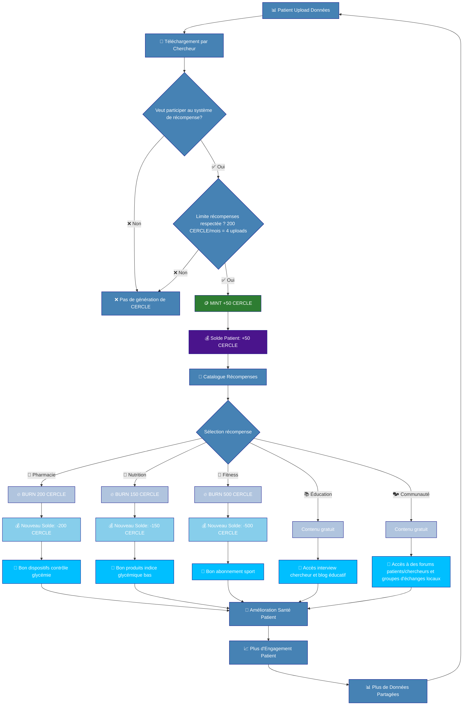
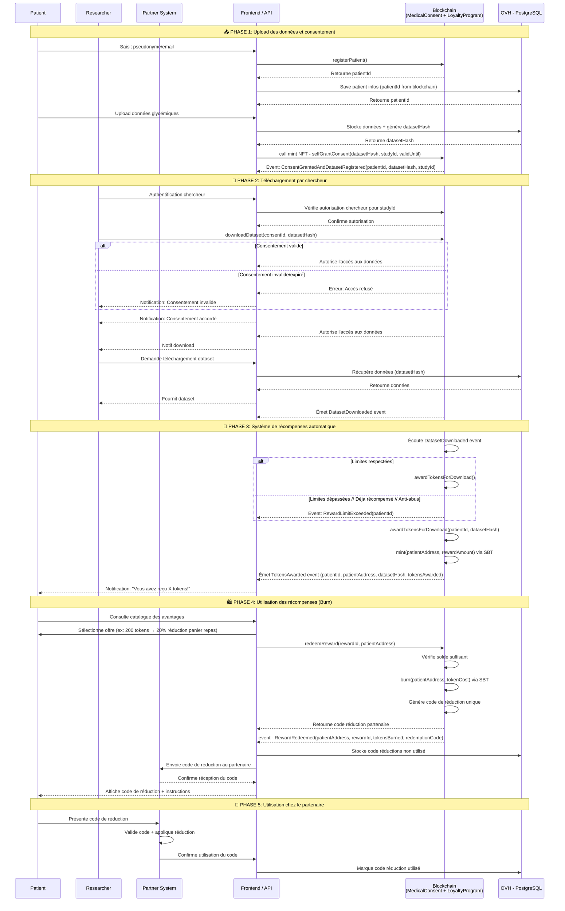

# Mon Cercle Sante
## Table des matières
* [Présentation](#présentation)
* [Roadmap ](#roadmap-et-améliorations-futures)
* [Sécurité ](#sécurité-et-mécanismes-anti-abus)
* [Consentement de partage de donnée](#consentement-de-partage-de-donnée)
* [CercleToken](#cercle-token--points-de-fidélités)
* [Economie circulaire CercleToken](#economie-circulaire-de-cercletoken)
* [Diagramme de séquence](#diagramme-de-séquence)

## Présentation

Cette application a pour but de permettre à des patients de charger des données médicales et de les partager avec des chercheurs afin de participer à des recherches sur le diabète, tout en garantissant leur confidentialité et leur protection. L'application vise à proposer du contenu éducatif, des interactions communautaires ainsi que des réductions sur des produits favorisant la prévention du diabète.

Le contrat [CercleConsent](backend/contracts/CercleConsent.sol) est un contrat de gestion de consentements médicaux basé sur les NFTs (ERC721) en mixant le concept de Soul Bound Token (token ayant un unique propriétaire, sans possibilité de transfert). Il permet au patient d'accorder et de révoquer leur consentement pour l'utilisation de leurs données médicales dans des études spécifiques.

Le contrat [CercleToken](backend/contracts/CercleToken.sol) est un contrat de création de points de fidélité basé sur l'ERC20, il implémente aussi le concept de SBT (Soul Bound Tokens). Ces points de fidélité sont appelés par la suite `CERCLE`. Un montant de CercleToken est créé sur le compte du patient pour chaque téléchargement de données par les chercheurs. Ils ont de multiples cas d'usages dans l'application (accès réduction panier repas, fitness, dispositifs pharmaceutiques, etc.).
Le système de récompenses automatique est basé sur la limite mensuelle de 200 CERCLE par patient. Chaque téléchargement de données génère 50 CERCLE. Si un patient atteint cette limite, il ne recevra plus de tokens. Cependant, il peut continuer à partager ses données sans être limité.

## Roadmap et améliorations futures

### Phase 1 - MVP (En cours)
- ✅ Smart contracts Consentement et CercleToken
- ✅ API backend et base de données
- ✅ Interface utilisateur 

### Phase 2 - Sécurité & Gamification

-  Refacto système autorisation (dashboard admin ?)
-  Rôle médecin oriente patient vers étude, chercheur, labo (dashboard: nb patientel, % patientel partageant données, programme recherche avec % de participation)
-  Rôle labo, publication étude, chercheur  
-  Sécurisé route en fonction des rôles
-  Amélioration table pour chercheur
- 🔮 Système de badges (Bronze, Argent, Or)
- 🔮 Défis de régularité :
    - 12 mois consécutifs = +200 CERCLE
    - 6 mois consécutifs = +100 CERCLE
    - 3 mois consécutifs = +50 CERCLE
- 🔮 Niveaux de contributeur avec avantages progressifs

### Phase 3 - Écosystème étendu
- 🔮 Intégration avec des partenaires de recherche.
- 🔮 Contenu blog éducatif (interview chercheur, responsable de recherche, article blockchain, article diabète)
- 🔮 Retours d'études vulgarisés et personnel pour les patients (ex :  "Vos données ont amélioré un modèle de mesure de glycémie", etc.)
- 🔮 Contenu recettes de cuisine indice glycémique bas. 
- 🔮 Groupes locaux de patients (les contributeurs se rencontrent - cf groupe de parole -, peuvent échanger entre eux et avec les chercheurs, co animation des groupes locaux avec les CHUs locaux ?) > Ce sera l'occasion d'identifier des besoins spécifiques à ce type de patients, de faire remonter les besoins, échanger sur les bonnes pratiques entre les groupes, d'ajuster la gamification / les badges ...)
- 🔮 Partenariats avec CHU locaux

## Sécurité et mécanismes anti-abus

### Identité protégée
- **RGPD** : Respect de la réglementation en matière de protection des données personnelles
- **Base de donnée HDS** : Stockage sécurisé et anonymisé des données
- **Sécurité des données** : Seul un hash de référence vers une base de donnée est stocké sur la blockchain, ce qui garantit la confidentialité des données. 

### Limitations des récompenses
- **Limite mensuelle** : 200 CERCLE maximum par patient par mois
- **Calcul mensuel** : Basé sur `block.timestamp / 30 days`
- **Reset automatique** : Les compteurs se remettent à zéro chaque nouveau mois
- **Pas de blocage d'upload** : Les patients peuvent continuer à partager des données même après avoir atteint la limite

### Soul Bound Tokens (SBT)
- **CercleToken** : Impossible de transférer les tokens entre comptes
- **CercleConsent** : Impossible de transférer les NFT de consentement
- **Objectif** : Éviter la spéculation et garantir que les récompenses restent liées au patient contributeur

### Contrôles d'accès
- **Patients autorisés** : Seuls les patients enregistrés peuvent recevoir des récompenses
- **Études autorisées** : Seules les études validées par l'administrateur peuvent collecter des consentements
- **Pause d'urgence** : Possibilité de suspendre les contrats en cas de problème

## Consentement de partage de donnée

### Gestion des patients
- `registerPatient()` : Permet à un utilisateur de s'enregistrer comme patient avec un identifiant unique.
- `isPatientRegistered(address)` : Vérifie si une adresse wallet est enregistrée comme patient.
- `getPatientId(address)` : Récupère l'identifiant d'un patient à partir de son adresse wallet.
- `getPatientInfo(uint256)` : Récupère les informations de base d'un patient (adresse, date d'enregistrement, statut).

### Gestion des consentements
- `selfGrantConsent(bytes32, bytes32, uint256)` : Permet à un patient d'accorder son consentement pour une étude spécifique avec une durée de validité.
- `revokeConsent(uint256 consentId, uint256 patientId)` : Permet à un patient de révoquer un consentement précédemment accordé.
- `isConsentValid(uint256 tokenId, uint256 patientId)` : Vérifie si un consentement est valide (actif et non expiré).
- `getConsentDetails(uint256 tokenId, uint256 patientId)` : Récupère les détails d'un consentement spécifique.
- `getPatientConsents(uint256 patientId)` : Récupère tous les consentements accordés par un patient.
- `getPatientConsentCount(uint256 patientId)` : Récupère le nombre de consentements d'un patient.
- `totalSupply()` : Récupère le nombre total de consentements actifs.

### Gestion des études
- `authorizeStudy(bytes32, string)` : Permet au propriétaire du contrat d'autoriser une nouvelle étude.
- `revokeStudyAuthorization(bytes32, string)` : Permet au propriétaire du contrat de révoquer l'autorisation d'une étude.
- `isStudyAuthorized(bytes32)` : Vérifie si une étude est autorisée.

### Administration du contrat
- `pause()` : Permet au propriétaire de mettre en pause le contrat (arrête les nouvelles attributions de consentement).
- `unpause()` : Permet au propriétaire de réactiver le contrat après une pause.

## Cercle Token : points de fidélités

### Récompenses automatiques
- `rewardForDataDownload(address patient, bytes32 datasetHash)` : Attribue 50 CERCLE pour un téléchargement de données.
- `MONTHLY_MINT_LIMIT` : Constante fixée à 200 CERCLE par mois.

### Échange de récompenses
- `redeemReward(uint256 tokenCost, string rewardType)` : Permet d'échanger des tokens contre des récompenses.

### Administration
- `setAuthorizedPatient(address patient, bool authorized)` : Autorise un patient à recevoir des récompenses.
- `pause()` / `unpause()` : Contrôle de l'état du contrat.

### Propriétés Soul Bound Token
- `isSoulBound()` : Retourne `true` (les tokens ne peuvent pas être transférés).
- `canTransfer()` : Retourne `false` (les transferts sont interdits).

### Economie circulaire de CercleToken

## Diagramme de séquence

## FAQ

**Q: Que se passe-t-il si j'atteins la limite mensuelle de 200 CERCLE ?**
R: Vous pouvez continuer à partager vos données, mais vous ne recevrez plus de nouveaux tokens jusqu'au mois suivant.

**Q: Puis-je transférer mes CERCLE à un autre patient ?**
R: Non, les CERCLE sont des Soul Bound Tokens liés à votre compte uniquement.

**Q: Comment puis-je révoquer mon consentement ?**
R: Vous pouvez révoquer votre consentement à tout moment via l'interface, ce qui rendra indisponible de vos données pour les études liées. L'application est conforme à la RGPD.

**Q: Les données sont-elles anonymisées ?**
R: Oui, seul un hash de la référence des données est stocké sur la blockchain. Les données personnelles et médicales sont stockées de manière sécurisée et anonymisée chez un hébergeur certifié HDS (Hébergeur de Données de Santé).
