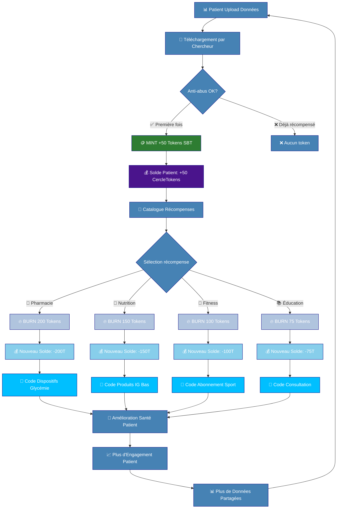
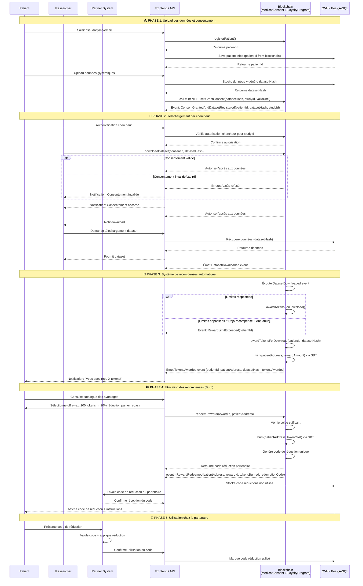

# Mon Cercle Sante
## Table des matières
* [Présentation](#présentation)
* [Economie circulaire CercleToken](#economie-circulaire-de-cercletoken)
* [Diagramme de séquence](#diagramme-de-séquence)
* [Gestion de consentements médicaux](#medicalconsent)
* [Génération et gestion des points fidélités](#cercle-token--points-de-fidélités)

## Présentation

Cette application a pour but de permettre à des patients de charger des données médicales et de les partager avec des chercheurs afin de participer à des recherches sur le diabète, tout en garantissant leur confidentialité et leur protection.

Le contrat `MedicalConsent` est un contrat de gestion de consentements médicaux basé sur les NFTs (ERC721) en mixant le concetp de Soul Bound Token (token ayant un unique propriétaire, sans possibilité de transfert). Il permet au patient d'accorder et de révoquer (burn du token) leur consentement pour l'utilisation de leurs données médicales dans des études spécifiques.

Le contrat `CercleToken` est un contrat de création de points de fidélités basé sur l'ERC20, il implémente aussi le concept de SBT (Soul Bound Tokens). Il permet au patient d'obtenir des points de fidélités pour chaque téléchargement de données par les chercheurs. Ces points ont de multiples cas d'usages dans l'application (accès réduction panier repas,fitness, dispositifs ) ce système de gestion de points est implémenté dans le contrat `CercleTokenRewards`.

## Economie circulaire de CercleToken :
to do: 
* clarifié régle anti abus (limitations annuel, mensuel) ne pas bloqué l'upload mais plus de mint de token.
* proposition d'offre gratuite:
      - lié à l'éducation (interview chercheur, responsable de recherche, article blockchain; article diabètique)
      - retour lié aux études qui donne un résultat vulgarisé au patient ( vos donnée ont améliorer un modèle de mesure de glycémie)
      - recette adapté aux diabètique 
* gamification badge (par rank bronze, or, argent) et défi de régularité qui donne bonus token ( 12 mois donne 200 token)

## Diagramme de séquence :

### MedicalConsent

#### Gestion des patients
- `registerPatient()` : Permet à un utilisateur de s'enregistrer comme patient avec un identifiant unique.
- `isPatientRegistered(address)` : Vérifie si une adresse wallet est enregistrée comme patient.
- `getPatientId(address)` : Récupère l'identifiant d'un patient à partir de son adresse wallet.
- `getPatientInfo(uint256)` : Récupère les informations de base d'un patient (adresse, date d'enregistrement, statut).

#### Gestion des consentements
- `selfGrantConsent(bytes32, bytes32, uint256)` : Permet à un patient d'accorder son consentement pour une étude spécifique avec une durée de validité.
- `revokeConsent(uint256)` : Permet à un patient de révoquer un consentement précédemment accordé.
- `isConsentValid(uint256)` : Vérifie si un consentement est valide (actif et non expiré).
- `getConsentDetails(uint256)` : Récupère les détails d'un consentement spécifique.
- `getPatientConsents(address)` : Récupère tous les consentements accordés par un patient.

#### Gestion des études
- `authorizeStudy(bytes32, string)` : Permet au propriétaire du contrat d'autoriser une nouvelle étude.
- `revokeStudyAuthorization(bytes32, string)` : Permet au propriétaire du contrat de révoquer l'autorisation d'une étude.
- `isStudyAuthorized(bytes32)` : Vérifie si une étude est autorisée.

#### Administration du contrat
- `pause()` : Permet au propriétaire de mettre en pause le contrat (arrête les nouvelles attributions de consentement).
- `unpause()` : Permet au propriétaire de réactiver le contrat après une pause.

## Cercle Token : points de fidélités

Token récompenseant les patients pour leurs contributions et engagement.
